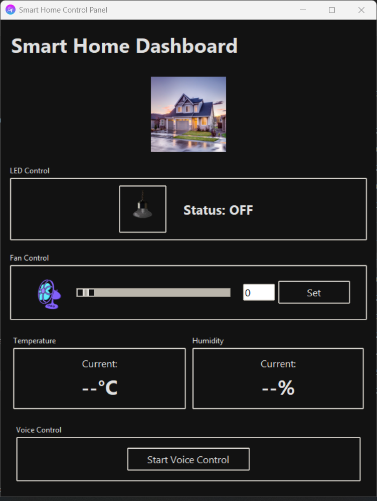

# Smart Home Control Panel

 <!-- Add your screenshot file if available -->

A Python-based GUI application for controlling smart home devices through MQTT with integrated voice control capabilities.

## Features

- 🚦 LED on/off control
- 🌀 Fan speed adjustment (0-255 range)
- 🌡️ Real-time temperature monitoring
- 💧 Humidity level display
- 🎤 Voice control integration
- 🌙 Dark mode interface
- 📱 Responsive design

## Installation

### Prerequisites

- Python 3.8 or later
- pip package manager

### Step-by-Step Setup

1. **Clone the repository**:
   ```bash
   git clone https://github.com/yourusername/smart-home-control.git
   cd smart-home-control
   ```
2. **Create and activate virtual environment**:
   ```bash
   python -m venv venv
   #On Windows:
   venv\Scripts\activate
   #On macOS/Linux:
   source venv/bin/activate
   ```
3. **Install dependencies**:
   ```bash
   pip install -r requirements.txt
   ```
4. **Required Image Files**:
Place these files in the project directory:

   - led_on.png

   - led_off.png

   - fan_on.png

   - fan_off.png

   - home_image.png

   - smart_home_icon.ico (optional)

5. **Install dependencies**:
    ```bash
    python GUI.py
    ```

### Key Files Explained:

1. **Core Files**:
   - `smart_home_control.py` - Main application logic and GUI
   - `VoiceControlForHome.py` - Voice command processor (create this file)

2. **Configuration**:
   - `requirements.txt` - Lists all Python package dependencies

3. **Resources**:
   - `assets/` folder contains all visual elements
   - PNG images should be 60x60 for controls, 120x120 for home image
   - ICO file for window icon (optional)

4. **Documentation**:
   - `README.md` - Installation and usage guide
   - `LICENSE` - Software license terms
